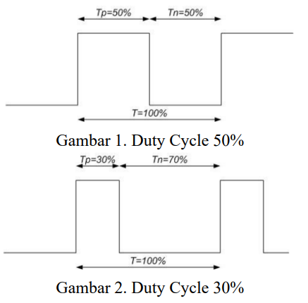

# PERTEMUAN 3
# ESP32 PWM (Pulse Width Modulation) dengan PlatformIO

## A. TUJUAN
Tujuan praktikum kali ini adalah:
1. Memberikan pemahaman mendalam mengenai penerapan teknik Pulse Width Modulation (PWM) menggunakan mikrokontroler ESP32 (seri S3 maupun C6).
2. Mengajarkan praktikan cara mengontrol perangkat aktuator (seperti LED, Motor Servo, atau Motor DC) menggunakan sinyal PWM, yang merupakan keterampilan dasar penting dalam bidang elektronika dan robotika.
3. Praktikan diharapkan memahami konsep PWM, bagaimana PWM dapat digunakan untuk mengendalikan perangkat output, dan penerapannya dalam skenario nyata dengan variasi perangkat keras yang berbeda antar kelompok.

## B. DASAR TEORI
PWM (Pulse Width Modulation) adalah salah satu teknik modulasi dengan mengubah lebar pulsa (duty cycle) dengan nilai amplitudo dan frekuensi yang tetap. Satu siklus pulsa merupakan kondisi high kemudian berada di zona transisi ke kondisi low. Lebar pulsa PWM berbanding lurus dengan amplitudo sinyal asli yang belum termodulasi. 

Duty Cycle merupakan representasi dari kondisi logika high dalam suatu periode sinyal dan dinyatakan dalam bentuk persentase (%) dengan rentang 0% sampai 100%. Sebagai contoh, jika sinyal berada dalam kondisi high terus menerus, artinya sinyal tersebut memiliki duty cycle sebesar 100%. Jika durasi sinyal keadaan high sama dengan keadaan low, maka sinyal mempunyai duty cycle sebesar 50%.



Dalam praktikum ini, PWM digunakan sebagai metode yang efektif untuk mengontrol output analog dengan menggunakan sinyal digital. PWM memanfaatkan lebar pulsa sinyal untuk merepresentasikan nilai analog, sehingga memungkinkan kontrol yang presisi terhadap perangkat aktuator. Konsep ini berbasis pada prinsip bahwa perubahan durasi (lebar) pulsa dalam sebuah siklus sinyal dapat menghasilkan efek analog, seperti penyesuaian tingkat kecerahan LED, pengaturan sudut gerak motor servo, atau pengaturan kecepatan putaran motor DC. 

ESP32 menyediakan fitur PWM terintegrasi yang memudahkan implementasi teknik ini dalam berbagai aplikasi. Terdapat dua parameter penting lainnya dalam pengaturan PWM selain *duty cycle*, yaitu:

- **Frekuensi (Frequency):** Menentukan seberapa cepat satu siklus penuh sinyal (*high* dan *low*) terjadi dalam satu detik, dinyatakan dalam satuan Hertz (Hz). Frekuensi yang digunakan sangat bergantung pada karakteristik aktuator. Sebagai contoh, pengontrolan LED umumnya menggunakan frekuensi yang relatif tinggi (misal: 5000 Hz) agar kedipan cahaya (*flicker*) tidak tertangkap oleh mata manusia. Sebaliknya, perangkat seperti Motor Servo standar umumnya membutuhkan frekuensi yang spesifik dan lebih rendah (umumnya 50 Hz).
- **Resolusi (Resolution):** Menentukan tingkat kehalusan rentang kendali *duty cycle* yang dapat diatur oleh program, yang dinyatakan dalam bit (misal: 8-bit, 10-bit, 12-bit). Sebagai contoh, jika kita menggunakan resolusi 8-bit, maka kita memiliki 256 tingkatan nilai (dari $0$ hingga $2^8-1$, yaitu 0 sampai 255) untuk merepresentasikan *duty cycle* 0% hingga 100%. Semakin tinggi nilai resolusi yang digunakan, semakin presisi dan halus perubahan pergerakan atau pencahayaan aktuator yang dikendalikan.

## C. ALAT DAN BAHAN
1. **Mikrokontroler:** ESP32-S3 atau ESP32-C6
2. Kabel Micro / Type C
3. Breadboard
4. Kabel Jumper
5. **Aktuator (Sesuai yang didapatkan kelompok):**
   - LED & Resistor (220 ohm)
   - Motor Servo
   - Motor DC & Driver Motor TB6612FNG
6. **Input / Sensor Tambahan (Sesuai yang didapatkan kelompok):**
   - Potensiometer 10k
   - Push Button & Resistor (10k ohm)
   - Rotary Encoder
   - Sensor Lingkungan / IMU (BME280/SHT4x, MPU6050/BMI160/ICM-series)
   - Modul Sensor Arus (INA219)

## D. REFERENSI KODE
Berikut adalah referensi kode dasar (potongan program) yang bisa kalian jadikan acuan.
### 1. Aktuator (Output)
**a. LED (Fading)**
Untuk mengatur tingkat kecerahan LED, kita menggunakan frekuensi tinggi (5000 Hz) dan resolusi 8-bit (0-255).
```cpp
const int pwmPin = 16;
const int freq = 5000;
const int pwmChannel = 0;
const int resolution = 8;

void setup() {
  ledcSetup(pwmChannel, freq, resolution);
  ledcAttachPin(pwmPin, pwmChannel);
}

void loop() {
  for(int dutyCycle = 0; dutyCycle <= 255; dutyCycle++) {
    ledcWrite(pwmChannel, dutyCycle);
    delay(15);
  }
}
```

**b. Motor Servo (Sweep)**
Motor Servo standar membutuhkan frekuensi **50 Hz**. Disarankan menggunakan resolusi **12-bit** (0-4095). Nilai *duty cycle* untuk sudut 0° hingga 180° umumnya berada di rentang nilai ~102 hingga ~512.
```cpp
const int servoPin = 16;
const int freq = 50;
const int channel = 0;
const int res = 12;

void setup() {
  ledcSetup(channel, freq, res);
  ledcAttachPin(servoPin, channel);
}

void loop() {
  ledcWrite(channel, 102); // Posisi ~0 derajat
  delay(1000);
  ledcWrite(channel, 512); // Posisi ~180 derajat
  delay(1000);
}
```

**c. Motor DC dengan Driver TB6612FNG**
Untuk mengontrol arah putaran, kita menggunakan pin IN1 dan IN2. Sedangkan kecepatan diatur dengan PWM pada pin PWMA. Pin STBY (Standby) harus selalu bernilai HIGH agar motor menyala.
```cpp
const int in1 = 17;
const int in2 = 18;
const int pwmPin = 16;
const int stby = 19;

void setup() {
  pinMode(in1, OUTPUT);
  pinMode(in2, OUTPUT);
  pinMode(stby, OUTPUT);
  
  digitalWrite(stby, HIGH); // Aktifkan driver
  digitalWrite(in1, HIGH);  // Atur arah putaran maju
  digitalWrite(in2, LOW);

  ledcSetup(0, 5000, 8);
  ledcAttachPin(pwmPin, 0);
}

void loop() {
  ledcWrite(0, 200); // Set kecepatan motor (0-255)
}
```

### 2. Referensi Input (Sensor/Kendali)
Kalian perlu membaca input dari pengguna atau lingkungan, lalu mengonversinya menjadi besaran *duty cycle* PWM untuk aktuator.

**a. Analog Input (Contoh: Potensiometer)**
ESP32 memiliki ADC 12-bit, sehingga nilai pembacaan analog berada di rentang 0 hingga 4095. Kalian bisa menggunakan fungsi `map()` untuk mengonversinya ke rentang PWM aktuator (misal 8-bit: 0-255).
```cpp
const int potPin = 34;

void setup() {
  // Inisialisasi aktuator PWM di sini
}

void loop() {
  int potValue = analogRead(potPin); // Hasil: 0 - 4095
  int pwmValue = map(potValue, 0, 4095, 0, 255); // Konversi ke 0 - 255
  
  // ledcWrite(channel, pwmValue);
  delay(15);
}
```

**b. Digital Input (Contoh: Push Button)**
Kalian bisa menggunakan mode `INPUT_PULLUP` pada ESP32, sehingga tombol akan bernilai `LOW` saat ditekan.
```cpp
const int buttonPin = 21;

void setup() {
  pinMode(buttonPin, INPUT_PULLUP);
}

void loop() {
  if (digitalRead(buttonPin) == LOW) {
    // Tombol sedang ditekan
    // (Masukkan logika penambahan nilai PWM di sini)
  }
}
```

**c. Sensor I2C (Contoh: BME280 / Suhu)**
Untuk sensor digital I2C, kalian membutuhkan library spesifik (misal: `Adafruit BME280`). 
```cpp
#include <Wire.h>
#include <Adafruit_Sensor.h>
#include <Adafruit_BME280.h>

Adafruit_BME280 bme;

void setup() {
  Wire.begin();
  bme.begin(0x76); // Alamat I2C default BME280
}

void loop() {
  float suhu = bme.readTemperature();
  // Gunakan variabel suhu untuk mengatur PWM aktuator
}
```

## E. TUGAS PRAKTIKUM
1. **Eksplorasi PWM pada Aktuator Utama:**
   - **Kelompok LED:** Buatlah sistem PWM yang terdiri dari minimal 3 buah LED. Atur agar ketiga LED tersebut menyala terang dan meredup secara bergantian.
   - **Kelompok Motor Servo:** Buatlah program untuk menggerakkan lengan servo secara perlahan dan halus (tidak patah-patah) dari sudut awal ke sudut maksimal, lalu kembali lagi menggunakan modifikasi parameter sinyal PWM.
   - **Kelompok Motor DC:** Buatlah program untuk mengontrol kecepatan putaran Motor DC menggunakan Driver TB6612FNG. Atur kecepatan putaran motor secara bertahap dari lambat ke cepat, lalu kembali ke lambat.

2. **Integrasi Dinamis dengan Input:**
   Gunakan komponen input yang kelompok kalian terima untuk mengontrol nilai sinyal PWM secara dinamis oleh pengguna.
   - **Kelompok LED:** Buatlah sistem PWM yang terdiri dari minimal 3 buah LED. Atur agar ketiga LED tersebut menyala terang dan meredup berdasarkan suhu dari BME280.
   - **Kelompok Motor Servo:** Buatlah program untuk menggerakkan lengan servo secara perlahan dan halus (tidak patah-patah) dari sudut awal ke sudut maksimal, lalu kembali lagi dan hanya terjadi saat momentary push button ditekan.
   - **Kelompok Motor DC:** Buatlah program untuk mengontrol kecepatan putaran Motor DC menggunakan Driver TB6612FNG. Atur kecepatan putaran motor berdasarkan potentiometer.

**Pertanyaan:**
1. Gambarkan bentuk grafik sinyal PWM ketika Duty Cycle bernilai 80%.
2. Pada program contoh pembelajaran awal, kita menggunakan frekuensi 5000 Hz yang cocok untuk LED. Menurut analisa kalian, apakah nilai frekuensi 5000 Hz ini juga bisa dan aman langsung digunakan untuk mengendalikan Motor Servo? Jelaskan alasannya berdasarkan karakteristik sinyal yang umumnya dibutuhkan oleh motor servo standar!
